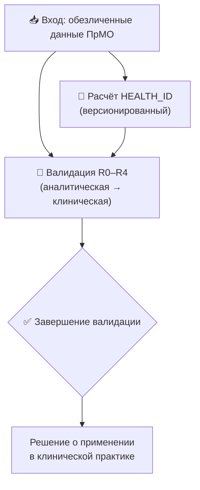
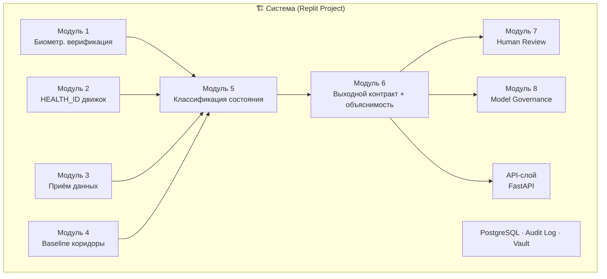
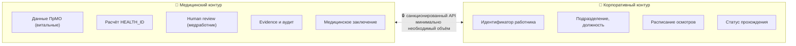
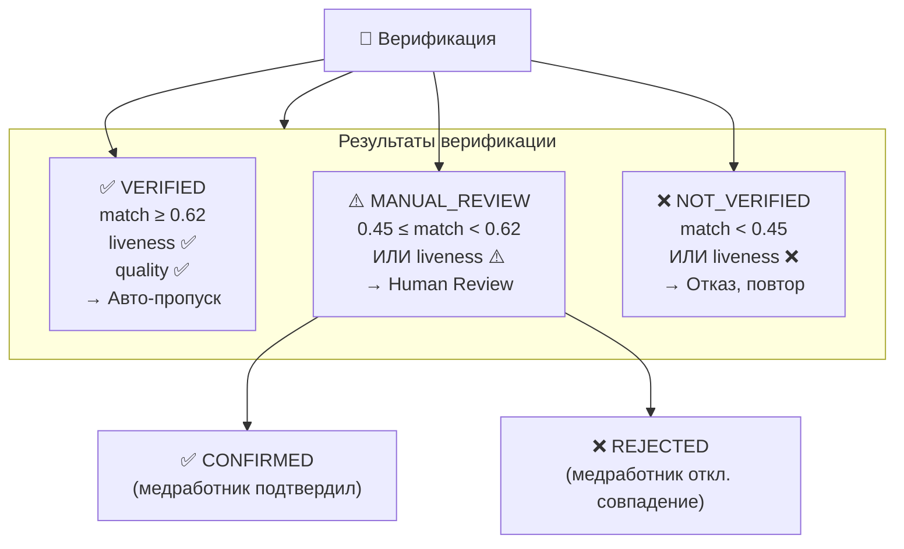
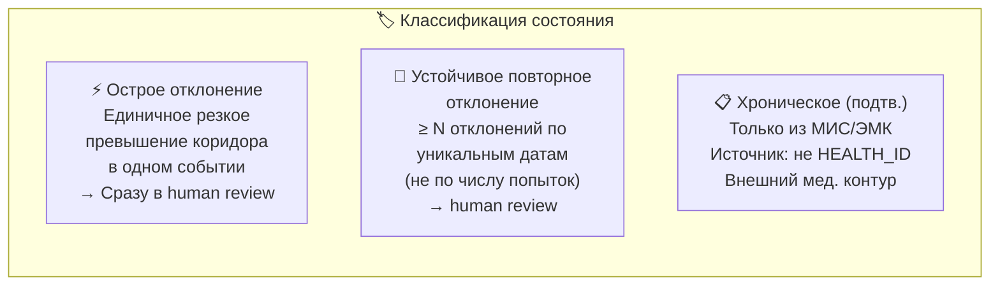
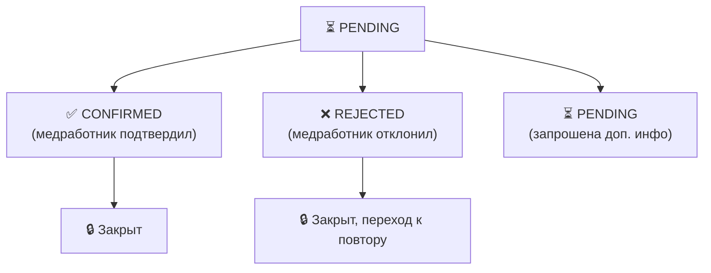
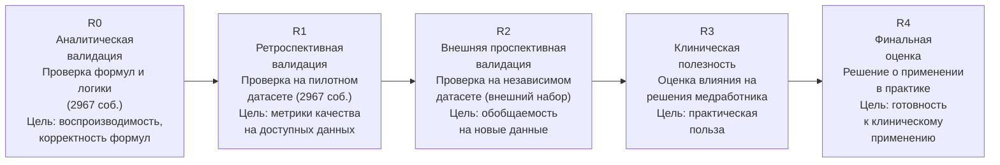
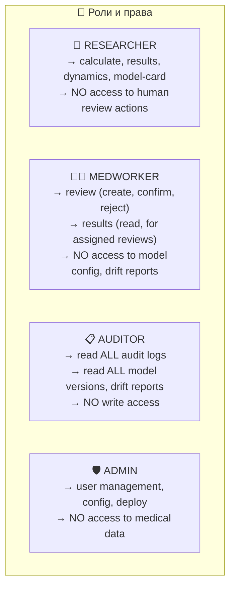

# Техническое задание: ИС УКЗ - Система биометрической верификации личности и исследовательский модуль HEALTH_ID для дистанционных периодических медицинских осмотров (ПрМО)
## 📑 Содержание

- [1. Общие сведения и цели 🎯](#1-общие-сведения-и-цели)
  - [1.1. Назначение](#11-назначение)
  - [1.2. Границы системы](#12-границы-системы)
  - [1.3. Исходные данные](#13-исходные-данные)
  - [1.4. Ключевое проектное решение](#14-ключевое-проектное-решение)
  - [1.5. Ключевые принципы](#15-ключевые-принципы)
  - [1.6. Основной результат](#16-основной-результат)
- [2. Нормативная база и регуляторные требования ⚖️](#2-нормативная-база-и-регуляторные-требования)
  - [2.1. Применимое законодательство](#21-применимое-законодательство)
  - [2.2. Ключевые регуляторные ограничения](#22-ключевые-регуляторные-ограничения)
  - [2.3. Принцип соответствия для исследовательского модуля](#23-принцип-соответствия-для-исследовательского-модуля)
- [3. Архитектура системы 🏗️](#3-архитектура-системы)
  - [3.1. Общая схема](#31-общая-схема)
  - [3.2. Разделение контуров](#32-разделение-контуров)
- [4. Модуль 1: Биометрическая верификация личности 👤](#4-модуль-1-биометрическая-верификация-личности)
  - [4.1. Функциональные требования](#41-функциональные-требования)
    - [4.1.1. Проверка соответствия лица (Face Matching)](#411-проверка-соответствия-лица-face-matching)
      - [4.1.1.1 Конфигурация модуля сравнения лиц](#4111-конфигурация-модуля-сравнения-лиц)
    - [4.1.2. Подтверждение живого присутствия (Liveness Detection)](#412-Подтверждение-живого-присутствия-liveness-detection)
      - [4.1.2.1 Конфигурация модуля Liveness Detection](#4121-конфигурация-модуля-liveness-detection)
    - [4.1.3. Контроль качества видео](#413-контроль-качества-видео)
  - [4.2. Маршрутизация результатов](#42-маршрутизация-результатов)
  - [4.3. Аудит верификации](#43-аудит-верификации)
  - [4.4. Модуль rPPG: бесконтактного измерения пульса и дыхания по видео](#44-модуль-rPPG-бесконтактного-измерения-пульса-и-дыхания-по-видео) 
- [5. Модуль 2: Движок расчёта HEALTH_ID 🧮](#5-модуль-2-движок-расчёта-healthid)
  - [5.1. Формула (исследовательская версия v1)](#51-формула-исследовательская-версия-v1)
  - [5.2. Версионирование модели](#52-версионирование-модели)
  - [5.3. Требования к движку](#53-требования-к-движку)
  - [5.4. Алгоритм расчёта](#54-алгоритм-расчёта)
  - [5.5. Конфигурация модуля HEALTH_ID](#55-конфигурация-модуля-healthid)
- [6. Модуль 3: Приём и контроль качества входных данных 📥](#6-модуль-3-приём-и-контроль-качества-входных-данных)
  - [6.1. Источник данных](#61-источник-данных)
  - [6.2. Контроль качества — чек-лист](#62-контроль-качества-чек-лист)
  - [6.3. Результат контроля качества](#63-результат-контроля-качества)
- [7. Модуль 4: Персональные коридоры (baseline) 📏](#7-модуль-4-персональные-коридоры-baseline)
  - [7.1. Назначение](#71-назначение)
  - [7.2. Алгоритм](#72-алгоритм)
  - [7.3. Требования к baseline](#73-требования-к-baseline)
- [8. Модуль 5: Классификация состояния 🏷️](#8-модуль-5-классификация-состояния)
  - [8.1. Категории состояний](#81-категории-состояний)
  - [8.2. Правила классификации](#82-правила-классификации)
- [9. Модуль 6: Выходной контракт и объяснимость 📋](#9-модуль-6-выходной-контракт-и-объяснимость)
  - [9.1. Структура выходного контракта](#91-структура-выходного-контракта)
  - [9.2. Требования к объяснимости](#92-требования-к-объяснимости)
- [10. Модуль 7: Клиническая проверка (Human Review) ✋](#10-модуль-7-клиническая-проверка-human-review)
  - [10.1. Статусы и переходы](#101-статусы-и-переходы)
  - [10.2. Структура review](#102-структура-review)
  - [10.3. Требования к human review](#103-требования-к-human-review)
- [11. Модуль 8: Управление (Model Governance) 🏛️](#11-модуль-8-управление-model-governance)
  - [11.1. Карточка модели (Model Card)](#111-model-card)
  - [11.2. Журнал версий](#112-журнал-версий)
  - [11.3. Тесты и валидационные отчёты](#113-тесты-и-валидационные-отчёты)
  - [11.4. Отслеживание дрейфа](#114-отслеживание-дрейфа)
  - [11.5. Конфигурация мониторинга дрейфа данных](#115-конфигурация-мониторинга-дрейфа-данных)
- [12. API-слой 🔌](#12-api-слой)
  - [12.1. Эндпоинты](#121-эндпоинты)
  - [12.2. Пример: расчёт HEALTH_ID](#122-пример-расчёт-healthid)
  - [12.3. Пример: human review](#123-пример-human-review)
  - [12.4. Требования к API](#124-требования-к-api)
- [13. Этапы валидации R0–R4 🔬](#13-этапы-валидации-r0r4)
  - [13.1. Общая схема](#131-общая-схема)
  - [13.2. Протоколы по этапам](#132-протоколы-по-этапам)
    - [R0 — Аналитическая валидация](#r0-аналитическая-валидация)
    - [R1 — Ретроспективная валидация](#r1-ретроспективная-валидация)
    - [R2 — Внешняя проспективная валидация](#r2-внешняя-проспективная-валидация)
    - [R3 — Клиническая полезность](#r3-клиническая-полезность)
    - [R4 — Финальная оценка](#r4-финальная-оценка)
- [14. Безопасность и разделение контуров 🔒](#14-безопасность-и-разделение-контуров)
  - [14.1. Обработка данных](#141-обработка-данных)
  - [14.2. Контроли доступа](#142-контроли-доступа)
  - [14.3. Аудит-лог](#143-аудит-лог)
- [15. Структура проекта в Replit 📁](#15-структура-проекта-в-replit)
- [16. Архитектура модулей 🛠️](#16-архитектура-модулей)
- [17. Технологический стек 🛠️](#17-технологический-стек)
- [18. План работ и контрольные точки 📅](#18-план-работ-и-контрольные-точки)
- [19. Дисклеймеры и ограничения ⚠️](#19-дисклеймеры-и-ограничения)
- [20. Прототип работающего приложения 🖥️](#20-прототип-работающего-приложения)

## 1. Общие сведения и цели 🎯

### 1.1. Назначение 

Система предназначена для двух независимых, но связанных задач:

- **Биометрическая верификация личности работника** при дистанционном прохождении ПрМО — проверка соответствия лица на видео эталонной фотографии, подтверждение присутствия живого человека (liveness detection), контроль качества видео и маршрутизация результатов.
- **Исследовательский модуль `HEALTH_ID`** — версионированный расчёт интегрального индекса здоровья на основе данных ПрМО с поэтапной клинической валидацией.

### 1.2. Границы системы

| ✅ В рамках | ❌ Вне рамок |
| --- | --- |
| Расчёт `HEALTH_ID` в исследовательском режиме | Постановка диагноза, назначение лечения |
| Верификация лица и liveness detection | Хранение эталонных биометрических шаблонов (только сравнение) |
| Маршрутизация результатов верификации | Принятие решения о допуске к работе |
| Human review для спорных случаев верификации | Human review для клинических заключений |
| Аудит, прослеживаемость, объяснимость расчёта | Интеграция с ФГИС ЕСИА / ЕБС (на следующем этапе) |
| Работа с обезличенными данными | Работа с персональными данными в идентифицируемом виде |

### 1.3. Исходные данные

- **Набор данных:** 2 967 событий ПрМО, период 2025–2026, 23 работника
- **Формат:** обезличенные данные (псевдонимизированные идентификаторы)
- **Назначение:** пилотное исследование интегрального индекса `HEALTH_ID`

### 1.4. Ключевое проектное решение

УКЗ-17 выполняет только биометрическую проверку 1:1: сравнивает видео текущей сессии с одним заранее выбранным эталонным фото. Модуль не ищет человека по базе 1:N, не устанавливает личность юридически и не принимает медицинское решение о допуске. Видео, фото и биометрические шаблоны остаются в защищенном контуре; УКЗ-14 получает только разрешенный технический статус, версию алгоритма и audit reference.

### 1.5. Ключевые принципы

| Принцип | Описание |
| --- | --- |
| 🔒 Прослеживаемость | Каждый расчёт восстанавливается |
| 📏 Разделение данных | Измеренное ≠ производное |
| 👩‍⚕️ Объяснимость | Медработник понимает результат |
| ✋ Human Review | Спорные случаи идут к человеку |
| 🏥 Разделение контуров | Медицинский ≠ корпоративный |
| ⚖️ Соответствие закону | 323-ФЗ, 152-ФЗ, ПП РФ № 866 |
| 🚫 Не медицинское изделие | Только исследовательский контекст до завершения валидации R0–R4 |

### 1.6. Основной результат

Работающий сервис, API-контракты, тесты, manual review, validation reports V0–V3 и документация

## 2. Нормативная база и регуляторные требования ⚖️

### 2.1. Применимое законодательство

| Закон / акт | Область применения в проекте |
| --- | --- |
| ФЗ № 323 от 21.11.2011 «Об основах охраны здоровья граждан» | Ст. 36.2 — телемедицинские технологии; ст. 46 ч. 9 — дистанционные медосмотры |
| ФЗ № 152 от 27.07.2006 «О персональных данных» | Ст. 9, 10, 11 — согласие, специальные категории, биометрия |
| ФЗ № 572 от 29.12.2022 — об идентификации с использованием биометрии | Рамки обработки биометрических данных, ЕБС |
| ПП РФ № 866 от 30.05.2023 — правила дистанционных медосмотров | Требования к медизделиям, идентификации личности работника |
| Приказ Минздрава № 266н от 30.05.2023 | Порядок проведения медосмотров с использованием медизделий |
| Приказ Минздрава № 193н от 11.04.2025 | Порядок организации телемедицинской помощи |

### 2.2. Ключевые регуляторные ограничения

- ⚠️ **Идентификация личности.** При дистанционном медосмотре идентификация личности работника производится с использованием ЕСИА, ГИС «Единая биометрическая система» или медизделий. В исследовательском режиме система работает с обезличенными данными и не выполняет идентификацию в юридическом смысле.
- ⚠️ **Биометрические данные.** Обработка биометрических ПДн (изображение лица) для установления личности требует письменного согласия субъекта. С 30.05.2025 идентификация на основе биометрии без аккредитации Минцифры запрещена. Исследовательский режим использует обезличенные данные.
- ⚠️ **Врачебная тайна.** Дистанционные медосмотры проводятся с соблюдением врачебной тайны и требований к ПДн.
- ⚠️ **Документирование.** Медицинское заключение оформляется с усиленной квалифицированной ЭП медработника.

### 2.3. Принцип соответствия для исследовательского модуля


## 3. Архитектура системы 🏗️

### 3.1. Общая схема



| Модуль | Назначение |
| --- | --- |
| **Модуль 1** | Биометрическая верификация (face match, liveness, quality, router) |
| **Модуль 1.1** | Модуль rPPG (remote Photoplethysmography) дополнение к liveness-проверке |
| **Модуль 2** | Версионированный движок расчёта `HEALTH_ID` |
| **Модуль 3** | Приём и контроль качества данных из МИС ЕЦОЗ |
| **Модуль 4** | Расчёт персональных коридоров (baseline) |
| **Модуль 5** | Классификация состояния (acute / persistent / chronic) |
| **Модуль 6** | Выходной контракт + объяснимость (evidence trace) |
| **Модуль 7** | Human Review — клиническая проверка медработником |
| **Модуль 8** | Model Governance — model card, версии, валидация, дрейф |
| **API-слой** | REST API (FastAPI) — эндпоинты, аутентификация, rate limiting |
| **Инфраструктура** | PostgreSQL · Audit Log · Vault |

### 3.2. Разделение контуров



**Что передаётся между контурами:**

| 🏥 Медицинский → Корпоративный | 🏢 Корпоративный → Медицинский |
| --- | --- |
| `verified` / `manual_review` / `not_verified` | Идентификатор работника |
| ID сессии верификации | Расписание осмотров (время, тип) |

**Что НЕ передаётся:**

| 🏥 Из медицинского контура | 🏢 Из корпоративного контура |
| --- | --- |
| ❌ Значения показателей | ❌ Медицинские данные |
| ❌ Диагнозы | ❌ Результаты расчёта `HEALTH_ID` |
| ❌ `HEALTH_ID` | |
| ❌ Метрики evidence | |

**Правило:** корпоративный контур получает только статус верификации личности и ID сессии. Медицинский контур не получает корпоративных атрибутов. Факт несовпадения личности не является медицинским недопуском.

## 4. Модуль 1: Биометрическая верификация личности 👤

### 4.1. Функциональные требования

#### 4.1.1. Проверка соответствия лица (Face Matching)

| Параметр | Требование |
| --- | --- |
| Вход 1 | Видеопоток с веб-камеры (min 640×480, 15 fps) |
| Вход 2 | Эталонная фотография из кадровой системы (получается при первичной идентификации через ЕСИА или ЕБС) |
| Алгоритм | Face embedding + косинусное расстояние |
| Порог совпадения | Настраиваемый, default: `cosine_similarity ≥ 0.62` |
| Результат | `match_score` (0.0–1.0) + `matched: bool` |

**Алгоритм:**
1. Извлечение кадров из видеопотока (не менее 5 кадров с интервалом).
2. Детекция лица на каждом кадре (Haar cascade (по-умолчанию), MTCNN или MediaPipe Face Detection, RetinaFace).
3. Вычисление векторного представления лица (face embedding) для каждого кадра с detected лицом.
4. Сравнение с векторным представлением эталонной фотографии (косинусное сходство).
5. Усреднение результатов по кадрам для устойчивости.

**Выходные данные:**
- `match_score`: float [0, 1] — итоговая оценка сходства;
- `per_frame_scores`: list[float] — оценки по кадрам;
- `best_frame_id`: int — идентификатор кадра с максимальной оценкой;
- `threshold`: float — использованный порог (из конфигурации версии модели);
- `decision`: enum — `match` / `no_match` / `insufficient_quality`.

**Пороговые значения** (версионируются, хранятся в config):
- `match` — `match_score >= 0.85`;
- `manual_review` — `0.60 <= match_score < 0.85`;
- `no_match` — `match_score < 0.60`.

##### 4.1.1.1. Конфигурация модуля сравнения лиц

Следующие параметры определяют, как система ищет и сопоставляет лицо на видео с эталонным фото и какие пороги использует для принятия решения.

**match_threshold**: `float = 0.85` — порог уверенного совпадения.
Если косинусное сходство между эмбеддингом лица на кадре и эталоном ≥ 0.85 — система считает, что это один и тот же человек. В процентах это примерно 85%, что заметно строже порога 75% из ваших предыдущих отчётов. Высокий порог снижает риск ложных срабатываний (когда чужого принимают за своего), но повышает риск ложных отказов (когда своего не узнают).

**manual_review_threshold**: `float = 0.60` — порог ручной проверки.
Если сходство ниже 0.85 (не уверенное совпадение), но ≥ 0.60 — результат неоднозначный, и система отправляет кадр на ручную проверку оператору. Всё, что ниже 0.60, — автоматический отказ. Это «серая зона»: похожесть есть, но недостаточно для автоматического решения.

**max_frames_to_process**: `int = 120` — максимум обрабатываемых кадров.
Из всего видео система возьмёт для сравнения не больше 120 кадров, даже если их тысячи. Это оптимизация производительности: 120 кадров достаточно для статистически надёжного вывода, а лишние только нагружают систему.

**frame_sample_interval**: `int = 5` — интервал выборки кадров.
Берётся каждый 5-й кадр, остальные пропускаются. Например, из видео с 30 fps будут взяты 6 кадров в секунду. Это быстрее, чем проверять каждый кадр, и даёт достаточно данных. В ваших предыдущих отчётах `step = 1 (каждый кадр)` — а здесь более экономный подход.

**min_detected_frames**: `int = 5` — минимальное число кадров с найденным лицом.
Если из всех обработанных кадров лицо найдено менее чем в 5 — система считает, что данных недостаточно для вывода, и просит переснять. Это защита от ситуаций, когда человек мелькнул на секунду и исчез: 5 кадров — минимальная база для статистики.

**embedding_method**: `str = "hog_lbp"` — метод извлечения признаков лица.
Комбинация HOG (Histogram of Oriented Gradients — гистограммы направленных градиентов) и LBP (Local Binary Patterns — локальные бинарные шаблоны). Это классические, лёгкие методы извлечения признаков, в отличие от глубоких нейросетей (ArcFace, FaceNet). Работают быстрее и не требуют GPU, но менее точны на сложных условиях (освещение, ракурс). Сходство в отчётах (63–69%) как раз характерно для таких методов — нейросетевые эмбеддинги обычно дают либо высокие значения (90%+ для того же человека), либо очень низкие (30–40% для чужого).

**detector_backend**: `str = "haar"` — детектор лиц.
Каскады Хаара (Viola-Jones) — старый, но быстрый метод обнаружения лиц. Работает на CPU, почти не требует ресурсов, но плохо справляется с поворотами, масками и сложным освещением. Это объясняет большой процент `no_face` в отчётах (27–46%): Haar-детектор просто не находит лица в неудобных ракурсах, тогда как современный детектор (MTCNN, RetinaFace) нашёл бы.

**Важно!** Переход на нейросетевые эмбеддинги (`ArcFace`, `FaceNet`) и более современный детектор — пороги и интерпретация значений будут другими, это стоит учитывать при калибровке.

#### 4.1.2. Подтверждение живого присутствия (Liveness Detection)

**Методы (комбинированный подход):**
1. **Eye blink detection** — анализ микродвижений, движения век между кадрами (оптический поток в зоне глаз).
2. **Head movement challenge** — реакция на инструкцию повернуть голову, улыбнуться, моргнуть (если реализован интерактивный режим).
3. **Texture analysis** — анализ текстурных признаков (LBP, частотный анализ) для выявления фотоподстановки с экрана.
4. **Depth estimation** — анализ глубины, при наличии стереокамеры или ToF‑сенсора (опционально, для будущих версий).

**Выходные данные:**
- `liveness_score`: float [0, 1];
- `liveness_signals`: dict — результаты по каждому методу;
- `decision`: enum — `live` / `spoof_detected` / `inconclusive`;
- `evidence_frames`: list[int] — идентификаторы кадров с аномалиями (при обнаружении spoof).

⚠️ **Требование к liveness:** минимальная устойчивость к атакам: фото-спуфинг, видеоспуфинг, 3D-маска. В исследовательском режиме фиксируется тип атаки, если обнаружена.

##### 4.1.2.1 Конфигурация модуля Liveness Detection

**Пороги решения**

**liveness_pass**: `float = 0.70` — порог прохождения. Если итоговый score ≥ 0.70 — liveness считается пройденным.
**liveness_fail**: `float = 0.50` — порог провала. Если score < 0.50 — автоматический отказ, человек не прошёл проверку.

Между 0.50 и 0.70 — «серая зона», результат которой, по аналогии с face match, скорее всего уходит на ручную проверку или повторную съёмку.

**Веса признаков (сумма = 1.0)**
В итоговый score liveness входят четыре компонента. Их веса определяют, насколько каждый признак влияет на финальную оценку:

Параметр	Вес	Что проверяет

blink_weight	0.35	Моргание — главный признак живого человека
head_motion_weight	0.30	Движение головы (повороты, наклоны)
texture_weight	0.25	Текстурный анализ — отличие реальной кожи от фото/экрана
depth_weight	0.10	Анализ глубины — есть ли 3D-структура лица
Вес 0.10 для depth объясняется следующим параметром — глубина отключена.

**Моргание (blink)**

blink_min_count: int = 1 — минимум одно моргание за всё видео достаточно. Это мягкий критерий: даже одно достоверное моргание засчитывается.
blink_min_ratio: float = 0.25 — минимальное отношение закрытия глаза. Eye Aspect Ratio (EAR) должен упасть хотя бы до 0.25 от открытого состояния, чтобы считаться морганием, а не помехой. Если человек «прищурился» на 10% — это не моргание.
Вес 0.35 — самый высокий, потому что моргание — один из надёжных и трудно подделываемых признаков живости. Подделать моргание на статичном фото невозможно, а на видео-подмене синхронизировать моргание с запросом системы очень сложно.

**Движение головы (head motion)**

head_motion_min_frames: int = 3 — минимум 3 кадра с зафиксированным движением головы. Имеется в виду не просто присутствие головы, а именно изменение её положения (yaw / pitch / roll) между кадрами. Трёх кадров достаточно, чтобы подтвердить, что движение есть, а не статичный кадр.
Вес 0.30 — второй по значимости. Логика: фото не двигается, предварительно записанное видео не реагирует на случайные запросы системы («поверните голову»).

**Текстурный анализ (texture)**

texture_lbp_threshold: float = 0.45 — порог по LBP (Local Binary Patterns). Если текстура лица по LBP-признакам отличается от ожидаемой для живой кожи больше чем на 0.45 — подозрение на подмену. LBP хорошо ловит разницу между реальной кожей и фотографией на бумаге или экране телефона (муар, пикселизация, блики).
texture_freq_threshold: float = 0.40 — порог по частотному анализу (Fourier). Реальное лицо имеет характерный спектр высоких частот; фото с экрана часто содержит артефакты (сетка пикселей, полосы), которые меняют частотную картину. Порог 0.40 — граница, выше которой текстура считается «неживой».
Вес 0.25 — текстура важна, но не определяюща: освещение и качество камеры могут давать ложные срабатывания.

**Глубина (depth)**

depth_enabled: bool = False — анализ глубины отключён. Несмотря на то, что вес depth = 0.10, модуль не используется. Скорее всего, потому что для него нужен либо стереокамера, либо ToF-датчик, либо структура из движения (structure from motion), а доступна только обычная веб-камера. При отключении вес 0.10 фактически перераспределяется или просто не учитывается — итоговый score считается из оставшихся трёх компонентов.
Как считается итоговый score
Схематично, без учёта нормализации:

```text
score = blink_score * 0.35
       + head_motion_score * 0.30
       + texture_score * 0.25
       + depth_score * 0.10   (depth_score = 0, т.к. отключён)
```       
Поскольку depth выключен, реальный максимум score = 0.90. Чтобы пройти порог liveness_pass = 0.70, нужно набрать минимум 0.70 из 0.90 возможных — то есть ≈ 78% от доступных баллов. Это достаточно строго: например, если моргание есть (0.35) и движение головы есть (0.30), но текстура подозрительная (близко к 0), score = 0.65 — не проходит.

**Замечания по архитектуре**

Blink — слабое место при min_count = 1. Одно моргание за видео можно подделать заранее записанным видео. Стоит повысить до 2–3, особенно для коротких видео (3–5 секунд).
Depth отключён — закономерно для веб-камеры, но это упрощает атаку с маской. Если есть доступ к нескольким кадрам с разных ракурсов, можно включить structure-from-motion как бюджетную замену ToF.
Текстурные пороги (0.45 и 0.40) — нужно калибровать на ваших данных. LBP и частотный анализ чувствительны к освещению и сжатию видео: при плохом свете реальное лицо может выглядеть «неживым».


#### 4.1.3. Контроль качества видео

**Проверяемые параметры:**

| Параметр | Порог | Действие при нарушении |
| --- | --- | --- |
| Разрешение | не менее 640×480 | `reject` |
| Частота кадров | не менее 15 fps | `reject` |
| Длительность | не менее 3 секунд | `reject` |
| Освещённость | уровень яркости в допустимом диапазоне | `warning` |
| Контрастность | коэффициент контраста > 0.3 | `warning` |
| Размытие | variance of Laplacian > 100 | `warning` |
| Наличие лица | минимум 1 лицо на 80 % кадров | `reject` |
| Позиция лица | фронтальное или почти фронтальное (yaw < 30°) | `warning` |

**Выходные данные:**
- `quality_metrics`: dict — значения всех параметров;
- `quality_score`: float [0, 1] — сводная оценка качества;
- `decision`: enum — `accept` / `degraded` / `reject`;
- `issues`: list[str] — описания выявленных проблем.


```python
QUALITY_CHECKS = {
    "resolution": {"min": (640, 480), "actual": None},  # разрешение видео
    "fps": {"min": 15, "actual": None},                 # минимальная частота кадров: не менее 15 кадров в секунду
    "lighting": {"min_lux": 100, "actual": None},
    "face_visibility": {"min_area_pct": 5, "actual": None},
    "blur": {"max_variance": 35, "actual": None},  # максимальная вариация размытия (из‑за тряски камеры, расфокусировки или быстрого движения).
    "occlusion": {"max_pct": 10, "actual": None},  # максимальная доля перекрытия лица не должна превышать 10%.
    "angle": {"max_yaw": 25, "max_pitch": 20, "max_roll": 15, "actual": None}, # максимальный поворот головы по горизонтали (yaw) не должен превышать 25 градусов, максимальный наклон головы вверх/вниз (pitch) не более 20 градусов., # наклон головы в сторону (roll) не более 15 
    "duration": {"min_sec": 3, "actual": None},      # минимальная длительность видео: не короче 3 секунд
}
```

Каждый чек возвращает `reject` / `fail` / `warning`. Результаты сохраняются в аудит.

### 4.2. Маршрутизация результатов



**Условия маршрутизации:**

| Статус | Условие | Действие |
| --- | --- | --- |
| `verified` | `match ≥ 0.62` + liveness ✅ + quality ✅ | Авто-пропуск |
| `manual_review` | `0.45 ≤ match < 0.62` ИЛИ liveness ⚠️ | Передача на Human Review |
| `not_verified` | `match < 0.45` ИЛИ liveness ❌ | Отказ, повторный запрос видео |

**Результат Human Review:**

| Статус | Описание |
| --- | --- |
| `confirmed` | Медработник подтвердил совпадение личности |
| `rejected` | Медработник отклонил совпадение личности |

### 4.3. Аудит верификации

Каждая сессия верификации фиксирует:

```python
audit_record = {
    "session_id": "uuid",
    "timestamp": "ISO-8601",
    "worker_pseudonym": "hash(SNP_ID)",
    "reference_photo_hash": "sha256",
    "video_hash": "sha256",
    "match_score": 0.73,
    "liveness_result": {"score": 0.89, "method": "combined"},
    "quality": {...},
    "route": "verified",
    "human_review": None | {...},
    "model_version": "face_v1.2.0",
    "config_snapshot": "hash(config)",
}
```

Каждая сессия верификации фиксирует:

⚠️ Видеоданные и эталонные фото не хранятся. Сохраняются только хеши и метаданные. В исследовательском режиме допускается временное хранение обезличенных фрагментов для отладки с автоудалением через 24 часа.

### 4.4. Модуль rPPG: бесконтактного измерения пульса и дыхания по видео

Технология улавливает микроскопические изменения цвета кожи, связанные с кровотоком, и по ним вычисляет сердечный ритм и частоту дыхания.

rPPG — мощное дополнение к liveness-проверке:

**Живой человек** имеет реальный пульс (пик в hr_band) и дыхание (пик в br_band).

**Фотография** — нулевой пульс, спектр белый шум — сигнал не пройдёт rppg_min_signal_quality.

**Видео-подмена (replay attack)** — пульс есть, но он не реагирует на liveness-запросы (поворот головы, моргание), и качество сигнала может отличаться из-за искажений при записи с экрана.

**Параметры захвата**

**rppg_min_fps**: float = 15.0 — минимальная частота кадров видео для rPPG: не менее 15 fps.
Чтобы уловить пульс (60–180 ударов/мин = 1–3 Гц), нужно минимум ~15 кадров/с по теореме Котельникова. Ниже — сигнал пульса не восстановить.

**rppg_min_duration**: float = 10.0 — минимальная длительность видео: не короче 10 секунд.
Для достоверного выделения частоты пульса из шумного сигнала нужно хотя бы 10 секунд (в идеале 15–30). Короткий отрезок не даст стабильного спектрального пика.

**rppg_target_fps**: int = 30 — целевая частота кадров для анализа: 30 fps.
Если видео снято с другой частотой (например, 24 или 60 fps), система интерполирует или прореживает до 30. Это унифицирует обработку и даёт запас по частоте Найквиста для пульса до 3 Гц (180 ударов/мин).

**Частотные полосы**

**hr_band**: tuple = (0.7, 3.0) — полоса частот для heart rate (пульса): 0.7–3.0 Гц.
Перевод в удары/минуту: 42–180 bpm. Это физиологический диапазон: пульс ниже 42 — брадикардия (или человек без сознания), выше 180 — тахикардия. Система ищет пик спектра именно в этом окне и считает его частотой пульса.

**br_band**: tuple = (0.15, 0.5) — полоса частот для breathing rate (дыхания): 0.15–0.5 Гц.
Перевод в циклы/минуту: 9–30 вдохов/мин. Нормальное дыхание взрослого — 12–20, при стрессе или нагрузке может быть выше. Пик в этой полосе = частота дыхания. Дыхание проявляется в rPPG как низкочастотная модуляция амплитуды пульсовой волны.

**Качество сигнала**

**rppg_min_signal_quality**: float = 0.3 — минимальное качество сигнала: 0.30.
rPPG-сигнал очень слабый — изменения цвета кожи составляют доли процента от яркости пикселей. На качество влияет освещение, движение, сжатие видео. Система вычисляет оценку качества (например, SNR — отношение сигнал/шум), и если она ниже 0.30 — результат считается ненадёжным. При плохом качестве видео система не пытается выдать пульс, а запрашивает пересъёмку.

Однако rPPG требует 10 секунд видео и хорошего освещения — это дольше, чем обычная liveness-проверка (3 секунды). Скорее всего, в вашей архитектуре rPPG используется как дополнительная проверка при подозрительных результатах основной liveness-проверки, а не на каждом прохождении.Как это работает в связке

**Схема обработки**:

**Однократный замер** — rPPG даёт пульс, дыхание, HRV. Из них считается базовый health_id score с весами.

**Скорая проверка** — если текущий замер отклоняется от нормы на Z > 2.0, проверяется, повторяется ли это 3 раза подряд (persistent_window).

**Хроническая проверка** — если за 10 замеров (chronic_window) наблюдается наклон > 2% (chronic_slope_pct) — фиксируется хронический тренд.

**Персонализация** — после 5 измерений (min_history_for_corridor) норма перестраивается под конкретного человека.

## 5. Модуль 2: Движок расчёта HEALTH_ID 🧮

### 5.1. Формула (исследовательская версия v1)

HEALTH_ID = $w_{\text{body}}$ * $h_{\text{body}}$ + $w_{\text{mental}}$ * $h_{\text{mental}}$ + $w_{\text{social}}$ * $h_{\text{social}}$ 

| Компонент | Вес | Источник данных |
| --- | --- | --- |
| `hBody` | 0,60 | Витальные показатели: ЧСС, АД (сист./диаст.), температура, сатурация, алкоголь |
| `hMental` | 0,25 | Оценка адекватности (медработник), связность речи, реакция зрачков |
| `hSocial` | 0,15 | Контекст: регулярность осмотров, пропуски, условия труда |

### 5.2. Версионирование модели

Каждая версия модели фиксируется в `model_card` со следующими атрибутами:

```yaml
model_version: "health_id_v1.0.0"
status: "research"  # research | validated | deprecated
created_at: "2026-09-15"
description: "Исследовательская версия интегрального индекса здоровья"

components:
  hBody:
    weight: 0.60
    features:
      - name: "heart_rate"
        unit: "bpm"
        source: "measured"       # measured | derived | context
        normal_range: [60, 90]
        quality_thresholds:
          min_confidence: 0.8
          max_artifact_pct: 5
        formula: "normalized_score(feature_value, normal_range)"
        contribution_weight: 0.25

      - name: "blood_pressure_systolic"
        unit: "mmHg"
        source: "measured"
        normal_range: [100, 130]
        formula: "normalized_score(feature_value, normal_range)"
        contribution_weight: 0.25

      - name: "blood_pressure_diastolic"
        unit: "mmHg"
        source: "measured"
        normal_range: [60, 85]
        formula: "normalized_score(feature_value, normal_range)"
        contribution_weight: 0.20

      - name: "temperature"
        unit: "°C"
        source: "measured"
        normal_range: [36.1, 37.2]
        formula: "normalized_score(feature_value, normal_range)"
        contribution_weight: 0.15

      - name: "spo2"
        unit: "%"
        source: "measured"
        normal_range: [95, 100]
        formula: "normalized_score(feature_value, normal_range)"
        contribution_weight: 0.10

      - name: "alcohol_test"
        unit: "mg/l"
        source: "measured"
        normal_range: [0, 0.15]
        formula: "binary_penalty(feature_value, threshold=0.16)"
        contribution_weight: 0.05

  hMental:
    weight: 0.25
    features:
      - name: "adequacy_score"
        unit: "0-10"
        source: "measured"    # оценка медработника
        normal_range: [7, 10]
        formula: "normalized_score(feature_value, normal_range)"
        contribution_weight: 0.40

      - name: "speech_coherence"
        unit: "0-10"
        source: "derived"     # анализ речи
        normal_range: [7, 10]
        formula: "normalized_score(feature_value, normal_range)"
        contribution_weight: 0.35

      - name: "pupil_reaction"
        unit: "0-10"
        source: "measured"
        normal_range: [7, 10]
        formula: "normalized_score(feature_value, normal_range)"
        contribution_weight: 0.25

  hSocial:
    weight: 0.15
    features:
      - name: "examination_regularity"
        unit: "ratio"
        source: "context"
        formula: "compliance_ratio(expected, actual)"
        contribution_weight: 0.50

      - name: "missed_examinations"
        unit: "count"
        source: "context"
        formula: "penalty_function(count, window=30d)"
        contribution_weight: 0.50

thresholds:
  green: [0.80, 1.00]    # норма
  yellow: [0.60, 0.80)  # внимание
  red: [0.00, 0.60)      # отклонение

uncertainty:
  min_completeness: 0.70   # минимум данных для расчёта
  partial_result: true      # считать с доступными данными, отмечать неполноту

quality_rules:
  exclude_if:
    - "artifact_pct > 10"
    - "confidence < 0.7"
  flag_if:
    - "unit_mismatch"
    - "measurement_protocol_violation"
```

### 5.3. Требования к движку

| Требование | Реализация |
| --- | --- |
| 📌 Фиксация версии | `model_version` обязательна для каждого расчёта. Версии неизменяемы. |
| 🔒 Неизменяемость конфигурации | После публикации версии `model_card` — заморозка. Изменения → новая версия. |
| 📊 Прослеживаемость | Для каждого результата сохраняется `config_snapshot_hash` — хеш полной конфигурации версии. |
| 🧪 Воспроизводимость | Повторный расчёт с теми же входными данными и той же версией → идентичный результат. |
| ⚠️ Разделение данных | `source: measured` — измерено прибором/медработником; `source: derived` — вычислено; `source: context` — контекстная информация. |
| 📋 Отделение от диагноза | `HEALTH_ID` не является диагнозом. В выходном контракте — явный дисклеймер. |

### 5.4. Алгоритм расчёта

```python
def calculate_health_id(input_data: HealthInput, model_version: str) -> HealthResult:
    """
    Полный пайплайн расчёта HEALTH_ID.
    """
    # 1. Загрузка неизменяемой конфигурации версии
    config = load_model_config(model_version)

    # 2. Валидация входных данных
    validated = validate_input(input_data, config)

    # 3. Расчёт компонентов
    hBody = calculate_component(validated, config.components.hBody)
    hMental = calculate_component(validated, config.components.hMental)
    hSocial = calculate_component(validated, config.components.hSocial)

    # 4. Расчёт итогового индекса
    health_id = (
        hBody.score * config.components.hBody.weight +
        hMental.score * config.components.hMental.weight +
        hSocial.score * config.components.hSocial.weight
    )

    # 5. Оценка неопределённости
    uncertainty = estimate_uncertainty(validated, hBody, hMental, hSocial)

    # 6. Оценка полноты данных
    completeness = calculate_completeness(validated)

    # 7. Проверка классификации состояния
    state_flags = classify_state(validated, model_version)

    # 8. Формирование evidence
    evidence = build_evidence(
        input_data=validated,
        config=config,
        components=[hBody, hMental, hSocial],
        contribution_trace=True
    )

    # 9. Формирование выходного контракта
    result = HealthResult(
        value=health_id,
        model_version=model_version,
        config_snapshot_hash=hash_config(config),
        components={
            "hBody": {"value": hBody.score, "weight": 0.60, "contribution": hBody.score * 0.60},
            "hMental": {"value": hMental.score, "weight": 0.25, "contribution": hMental.score * 0.25},
            "hSocial": {"value": hSocial.score, "weight": 0.15, "contribution": hSocial.score * 0.15},
        },
        completeness=completeness,
        uncertainty=uncertainty,
        state_flags=state_flags,
        evidence=evidence,
        disclaimer="Исследовательский результат. Не является медицинским диагнозом.",
    )

    return result
```

### 5.5. Конфигурация модуля HEALTH_ID

Веса компонентов health ID
Параметр	Вес	Что отражает
heart_rate	0.25	Пульс — основной витальный показатель
hrv	0.20	Вариабельность сердечного ритма — показатель адаптации нервной системы
breathing_rate	0.15	Частота дыхания
stress_index	0.15	Индекс стресса (на основе HRV и других метрик)
signal_quality	0.15	Качество сигнала rPPG — насколько данным можно доверять
verification_quality	0.10	Качество верификации (освещение, ракурс, детекция лица)
Сумма весов = 1.0. Пульс и HRV вместе дают почти половину (0.45) — это ядро оценки, так как они наиболее информативны для дистанционной оценки состояния.

Пороги решения
Порог	Значение	Что значит
health_id_good	0.80	Score ≥ 0.80 → состояние хорошее, отклонений нет
health_id_warning	0.60	0.60–0.80 → предупреждение, возможны отклонения
—	< 0.60	Зона риска, требуется внимание
Анализ аномалий (острые и хронические)
acute_z_threshold: float = 2.0 — порог Z-score для обнаружения острых отклонений.
Z-score показывает, насколько текущее значение отличается от среднего в стандартных отклонениях. Z = 2.0 означает, что показатель отклонился на 2 сигмы от своей нормы — это статистически значимая аномалия. Применяется для внезапных изменений: резкий скачок пульса, падение HRV.

persistent_window: int = 3 — окно обнаружения острых аномалий: 3 последних измерения.
Если аномалия (Z > 2.0) держится 3 измерения подряд — это не случайный выброс, а устойчивое острое отклонение. Меньше 3 — может быть разовым сбоем измерения.

chronic_window: int = 10 — окно для хронических (длительных) трендов: 10 измерений.
Система анализирует последние 10 замеров, чтобы выявить медленный, но устойчивый сдвиг показателей — например, постепенное повышение пульса покоя за недели.

chronic_slope_pct: float = 0.02 — минимальный наклон тренда для хронической аномалии: 2% за окно.
Если показатели меняются плавно, но наклон линии тренда превышает 2% — фиксируется хроническое отклонение. Это ловит медленные дрейфы, которые не.trigger острые аномалии (Z > 2.0), но накапливаются со временем.

min_history_for_corridor: int = 5 — минимум 5 измерений для построения «коридора нормы».
Пока накоплено менее 5 замеров, система не оценивает динамику — недостаточно данных для персональной нормы. После 5 измерений строится индивидуальный коридор (среднее ± стандартное отклонение), и последующие замеры сравниваются уже с ним.

Как это работает в связке
Схема обработки:

Однократный замер — rPPG даёт пульс, дыхание, HRV. Из них считается базовый health_id score с весами.
Скорая проверка — если текущий замер отклоняется от нормы на Z > 2.0, проверяется, повторяется ли это 3 раза подряд (persistent_window).
Хроническая проверка — если за 10 замеров (chronic_window) наблюдается наклон > 2% (chronic_slope_pct) — фиксируется хронический тренд.
Персонализация — после 5 измерений (min_history_for_corridor) норма перестраивается под конкретного человека.

## 6. Модуль 3: Приём и контроль качества входных данных 📥

### 6.1. Источник данных

Данные поступают из МИС ЕЦОЗ в виде событий ПрМО. Структура входного пакета:

```json
{
  "event_id": "uuid",
  "event_type": "periodic_medical_examination",
  "worker_pseudonym": "hash(SNP_ID)",
  "timestamp": "ISO-8601",
  "measurements": {
    "vitals": [
      {
        "name": "heart_rate",
        "value": 72,
        "unit": "bpm",
        "device_id": "med_device_001",
        "device_model": "ТМ-4",
        "measurement_protocol": "standard_v2",
        "confidence": 0.95,
        "artifact_pct": 2,
        "timestamp": "ISO-8601"
      }
    ],
    "mental": [...],
    "context": {
      "workplace": "plant_A",
      "shift": "morning",
      "examination_type": "periodic"
    }
  },
  "metadata": {
    "mis_source": "ECOZ",
    "transmission_id": "uuid",
    "transmission_timestamp": "ISO-8601"
  }
}
```

### 6.2. Контроль качества — чек-лист

| # | Проверка | Категория | Действие при провале |
| --- | --- | --- | --- |
| 1 | Происхождение данных (МИС ЕЦОЗ) | `origin` | Отклонить пакет |
| 2 | Целостность пакета (hash, подпись) | `integrity` | Отклонить пакет |
| 3 | Единицы измерения соответствуют формату | `units` | Пометить `unit_mismatch` |
| 4 | Качество сигнала (`confidence ≥ 0.7`) | `quality` | Пометить `low_quality` |
| 5 | Процент артефактов (≤ 10%) | `quality` | Пометить `high_artifact` |
| 6 | Полнота данных (все обязательные признаки) | `completeness` | Пометить `incomplete` |
| 7 | Соответствие протоколу измерений | `protocol` | Пометить `protocol_violation` |
| 8 | Временные рамки (event в допустимом окне) | `timing` | Пометить `stale_data` |
| 9 | Дубликаты (`event_id` уникален) | `dedup` | Отклонить дубль |

### 6.3. Результат контроля качества

```python
quality_report = {
    "overall": "pass" | "pass_with_warnings" | "fail",
    "checks": [
        {"name": "origin", "status": "pass", "detail": "ECOZ verified"},
        {"name": "units", "status": "pass", "detail": "all units valid"},
        {"name": "completeness", "status": "warning",
         "detail": "missing: speech_coherence", "missing_count": 1},
    ],
    "actionable_flags": ["incomplete"],
    "exclusion_flags": [],
}
```

⚠️ Пакеты с `fail` не поступают в расчёт, но фиксируются в аудите. Пакеты с `warning` допускаются к расчёту с пометкой неполноты.

## 7. Модуль 4: Персональные коридоры (baseline) 📏

### 7.1. Назначение

Расчёт индивидуальных коридоров норм для каждого работника на основе его предыдущих качественных измерений. Коридоры используются для определения персонального отклонения — отличается ли текущий показатель от привычного для данного человека.

### 7.2. Алгоритм

```python
def calculate_baseline(worker_pseudonym: str,
                       current_event_id: str,
                       window_days: int = 90) -> Baseline:
    """
    Расчёт персональных коридоров с исключением текущей точки.

    ВАЖНО: текущее измерение ИСКЛЮЧАЕТСЯ из baseline,
    чтобы предотвратить утечку данных (data leakage).
    """
    history = fetch_history(
        worker_pseudonym=worker_pseudonym,
        exclude_event_id=current_event_id,  # ⚠️ анти-утечка
        window_days=window_days,
        quality_filter="pass"  # только качественные измерения
    )

    if len(history) < 3:
        return Baseline(
            available=False,
            reason="insufficient_history",
            min_points=3
        )

    baseline = {}
    for feature in FEATURES:
        values = [h[feature] for h in history if feature in h]
        if len(values) < 3:
            baseline[feature] = {"available": False}
            continue

        baseline[feature] = {
            "available": True,
            "mean": np.mean(values),
            "std": np.std(values),
            "median": np.median(values),
            "p5": np.percentile(values, 5),
            "p95": np.percentile(values, 95),
            "corridor_low": np.mean(values) - 2 * np.std(values),
            "corridor_high": np.mean(values) + 2 * np.std(values),
            "n_points": len(values),
            "window_days": window_days,
            "excluded_event": current_event_id,  # ⚠️ фиксация исключения
        }

    return Baseline(available=True, features=baseline)
```

### 7.3. Требования к baseline

| Требование | Описание |
| --- | --- |
| 🚫 Исключение текущей точки | Текущее измерение никогда не входит в расчёт своего baseline |
| 📊 Минимум данных | ≥ 3 качественных точек для построения коридора |
| 🕐 Окно наблюдения | Настраиваемое, default: 90 дней |
| 🔄 Обновление | Baseline пересчитывается для каждого нового события |
| 📋 Аудит | Источник каждого значения baseline прослеживается до `event_id` |
| ⚠️ Проверка дрейфа | При существенном изменении baseline (Стьюдент, $p < 0{,}05$) — пометка `baseline_drift` |

## 8. Модуль 5: Классификация состояния 🏷️

### 8.1. Категории состояний



### 8.2. Правила классификации

```python
CLASSIFICATION_RULES = {
    "acute_deviation": {
        "trigger": "any_feature outside corridor_high or corridor_low by > 2σ",
        "scope": "single event",
        "action": "flag_acute → human_review",
        "audit": "full_evidence_chain",
    },
    "persistent_repeated_deviation": {
        "trigger": "≥ 3 events with acute deviation in unique dates within 30 days",
        "scope": "rolling window, unique dates only",
        "⚠️ important": "count by unique_dates, NOT by number of attempts",
        "action": "flag_persistent → human_review → possible chronic referral",
        "audit": "all flagged events with event_ids and dates",
    },
    "confirmed_chronic": {
        "trigger": "diagnosis present in MIS/EMK",
        "source": "MIS or EMK ONLY",
        "⚠️ NOT_from": "HEALTH_ID calculation",
        "action": "flag_chronic → include in context, not in score",
        "audit": "MIS record reference",
    },
}
```

⚠️ **Критически важное правило:** подсчёт повторных отклонений ведётся по уникальным датам событий, а не по числу попыток измерения в один день. Если работник прошёл осмотр 3 раза 15 сентября — это одна дата, а не три отклонения.

## 9. Модуль 6: Выходной контракт и объяснимость 📋

### 9.1. Структура выходного контракта

```json
{
  "result_id": "uuid",
  "event_id": "uuid",
  "worker_pseudonym": "hash(SNP_ID)",
  "timestamp": "2026-09-15T10:30:00+04:00",

  "health_id": {
    "value": 0.82,
    "category": "green",
    "model_version": "health_id_v1.0.0",
    "config_snapshot_hash": "sha256:...",
    "disclaimer": "Исследовательский результат. Не является медицинским диагнозом."
  },

  "components": {
    "hBody": {
      "value": 0.85,
      "weight": 0.60,
      "contribution": 0.51,
      "contribution_pct": 62.2,
      "features": [
        {
          "name": "heart_rate",
          "raw_value": 72,
          "unit": "bpm",
          "source": "measured",
          "normalized_score": 0.90,
          "normal_range": [60, 90],
          "contribution_weight": 0.25,
          "contribution": 0.225,
          "quality": {"confidence": 0.95, "artifact_pct": 2},
          "in_baseline_corridor": true,
          "baseline_corridor": [65, 88],
          "deviation": "none"
        }
      ]
    },
    "hMental": { ... },
    "hSocial": { ... }
  },

  "completeness": {
    "overall": 0.92,
    "required_features_present": 11,
    "required_features_total": 12,
    "missing": ["speech_coherence"],
    "missing_impact": "hMental partially estimated"
  },

  "uncertainty": {
    "overall": 0.08,
    "sources": [
      {"type": "missing_feature", "feature": "speech_coherence", "impact": 0.05},
      {"type": "measurement_confidence", "feature": "temperature", "impact": 0.03}
    ]
  },

  "state_flags": [
    {
      "flag": "acute_deviation",
      "active": false,
      "details": null
    },
    {
      "flag": "persistent_repeated_deviation",
      "active": false,
      "details": null
    },
    {
      "flag": "confirmed_chronic",
      "active": false,
      "details": null
    },
    {
      "flag": "personal_deviation",
      "active": true,
      "feature": "blood_pressure_systolic",
      "value": 142,
      "corridor_high": 135,
      "deviation_type": "above_corridor",
      "sigma": 2.3
    }
  ],

  "evidence": {
    "input_ids": ["event_001", "event_002"],
    "quality_reports": [ { ... } ],
    "formulas_applied": [
      "normalized_score(72, [60, 90]) = 0.90",
      "binary_penalty(0.0, threshold=0.16) = 1.00"
    ],
    "norms_used": { ... },
    "contribution_trace": {
      "hBody": {
        "heart_rate": {"score": 0.90, "weight": 0.25, "product": 0.225},
        "blood_pressure_systolic": {"score": 0.70, "weight": 0.25, "product": 0.175},
        ...
      },
      "total": 0.82
    },
    "baseline_used": {
      "available": true,
      "n_historical_points": 15,
      "window_days": 90,
      "excluded_event": "event_001"
    },
    "model_card_ref": "health_id_v1.0.0"
  },

  "audit": {
    "calculation_timestamp": "ISO-8601",
    "duration_ms": 142,
    "config_snapshot_hash": "sha256:...",
    "reproducible": true
  }
}
```

### 9.2. Требования к объяснимости

| Аудитория | Что должна понимать |
| --- | --- |
| 👩‍⚕️ Медработник | Какой признак отклонился, на сколько, какой коридор, что вклад в общий результат |
| 🔬 Исследователь | Полный trace: формулы, норм-диапазоны, веса, источники данных |
| 📋 Аудитор | Прослеживаемость от входного значения до финального числа, неизменность конфигурации |

✋ **Human-readable explanation** — генерируется автоматически в виде текста:

```text
РЕЗУЛЬТАТ HEALTH_ID: 0.82 (зелёная зона)

Составляющие:
• Физическое состояние (hBody): 0.85, вклад 62%
  - ЧСС 72 bpm (норма 60–90) — в норме
  - АД сист. 142 mmHg (норма 100–130, коридор 110–135) — отклонение ↑
  - Температура 36.6°C — в норме
  - Сатурация 98% — в норме
  - Алкоголь: 0.00 — отрицательный
• Психическое состояние (hMental): 0.78, вклад 24%
  - Адекватность: 8/10 — в норме
  - Речь: не измерено (оценка по доступным данным)
  - Зрачки: 9/10 — в норме
• Социальный контекст (hSocial): 0.80, вклад 14%
  - Регулярность осмотров: 94% — в норме

⚠️ Персональное отклонение: АД систолическое (142 vs коридор 110–135)
ℹ️ Полнота данных: 92% (отсутствует: оценка речи)
ℹ️ Неопределённость: ±0.08

📌 Это исследовательский результат, не медицинский диагноз.
```

## 10. Модуль 7: Клиническая проверка (Human Review) ✋

### 10.1. Статусы и переходы



### 10.2. Структура review

```python
review = {
    "review_id": "uuid",
    "session_id": "uuid",          # связь с сессией верификации
    "event_id": "uuid",             # связь с событием ПрМО
    "status": "pending",            # pending | confirmed | rejected
    "assigned_to": "medworker_pseudonym",
    "created_at": "ISO-8601",
    "resolved_at": null,

    "trigger_reason": "manual_review_route" | "acute_deviation" | "persistent_deviation",
    "trigger_data": { ... },

    "reviewer_comment": "",
    "evidence": [
        {
            "type": "screenshot",
            "hash": "sha256:...",
            "description": "Кадр из видео верификации"
        },
        {
            "type": "comparison",
            "match_score": 0.52,
            "threshold": 0.62,
            "note": "Сходство низкое, но качество видео среднее"
        }
    ],

    "audit": {
        "reviewer_id": "hash",
        "reviewer_role": "medical_worker",
        "decision_timestamp": "ISO-8601",
        "previous_status": "pending",
        "new_status": "confirmed",
        "ip_hash": "sha256",
    }
}
```

### 10.3. Требования к клинической проверки

| Требование | Описание |
| --- | --- |
| 👩‍⚕️ Назначение | Только медработник, зарегистрированный в ЕГИСЗ |
| 📋 Комментарий | Обязателен при `confirmed` и `rejected` |
| 🔒 Неизменяемость | После `confirmed` / `rejected` — статус неизменяем |
| 📊 Доказательства | Прикладываются хеши материалов, на основе которых принято решение |
| 🕐 SLA | `pending` → решение за 30 минут (настраиваемо) |
| ⚠️ Несовпадение ≠ недопуск | Факт несовпадения личности не является медицинским недопуском. Это технический результат верификации, передаваемый для решения медработнику. |
| 📝 Аудит | Все изменения статуса — в журнал аудита, с `timestamp`, `reviewer`, `diff` |

## 11. Модуль 8: Управление (Model Governance) 🏛️

### 11.1. Карточка модели (Model Card)

Это документ ‑ `паспорт`, который фиксирует, что делает модель или расчётный алгоритм, в каком статусе находится, какие есть ограничения.  Это способ обеспечить безопасность, прозрачность, воспроизводимость и соответствие регуляторным требованиям (особенно важно для медицинских расчётов).

**Прослеживаемость (traceability)**. По версии v1.0.0 можно однозначно восстановить, какие веса и формулы использовались в конкретном расчёте.

**Human review и объяснимость**. Это формальный способ зафиксировать, что расчёт требует проверки медработником и не является автономным диагнозом.

**Разделение контуров**. Статус research и дата версии — это технические маркеры, которые помогают доказать, что корпоративный контур не использует `боевые` медицинские решения без валидации.

**Валидация R0–R4**. Каждая стадия валидации привязывается к конкретной версии модели: в примере ниже `валидация R2 проведена для v1.0.0 с весами 0.6/0.25/0.15`.

```yaml
# model_card.yaml
model_name: "HEALTH_ID"
model_version: "v1.0.0"
status: "research"
created_at: "2026-09-15"

description: |
  Исследовательский интегральный индекс здоровья для
  периодических медицинских осмотров. Не является
  медицинским изделием. Применяется только в
  исследовательских целях.

intended_use: |
  Воспроизводимый расчёт интегрального показателя
  здоровья работника на основе витальных данных,
  психофизиологической оценки и контекстных факторов.

out_of_scope:
  - "Постановка диагноза"
  - "Назначение лечения"
  - "Решение о допуске к работе"
  - "Замена медицинского заключения"

components:
  hBody: {weight: 0.60, features: 6}
  hMental: {weight: 0.25, features: 3}
  hSocial: {weight: 0.15, features: 2}

training_data:
  description: "Обезличенный набор ПрМО"
  events: 2967
  workers: 23
  period: "2025-2026"

validation_status:
  R0_analytical: "planned"
  R1_retrospective: "planned"
  R2_external_prospective: "planned"
  R3_clinical_utility: "planned"
  R4_final: "planned"

risks:
  - "Малая выборка (23 работника) — низкая статистическая мощность"
  - "Возможен selection bias — только работники, проходившие ПрМО"
  - "Персональные коридоры могут быть нестабильны при малом числе точек"
  - "Отсутствие внешнего набора для валидации на R0–R1"

limitations:
  - "Исследовательская версия формулы — веса не валидированы"
  - "Пороги и нормы требуют клинической верификации"
  - "Не применимо к новым работникам без истории (нет baseline)"

mitigations:
  - "Чёткая маркировка статуса research во всех результатах"
  - "Дисклеймер в каждом выходном контракте"
  - "Ограничение доступа — только исследовательский контур"
  - "Полный аудит всех расчётов"
```

**Имя модели/алгоритма**. Здесь явно указано, что карточка относится к расчёту индекса HEALTH_ID. Это нужно, чтобы не путать разные компоненты системы (например, liveness, face match и сам индекс).

**Версия движка расчёта**. Версионирование критично: если завтра поменяются веса или формулы, ты сможешь ссылаться на v1.0.0 как на зафиксированную, проверенную версию. Это основа для воспроизводимости и валидации R0–R4.

**Статус использования**. Значение research прямо говорит: модель/расчёт не для юридически значимой идентификации и не для окончательных медицинских выводов. Это исследовательский индекс, который требует human review и валидации. Такой статус помогает юридически разграничить контуры (медицинский vs корпоративный) и зафиксировать, что система не подменяет врачебное заключение.

**Дата создания версии**. Нужна для аудита и отслеживания, когда именно была зафиксирована эта конфигурация (веса, логика, допущения). В исследовательском проекте это важно для протоколов валидации и при проверках.


### 11.2. Журнал версий

```python
# versions.jsonl — append-only
{"version": "v1.0.0", "created_at": "2026-09-15", "status": "research",
 "changes": "initial release", "config_hash": "sha256:abc123"}
{"version": "v1.0.1", "created_at": "2026-10-01", "status": "research",
 "changes": "adjusted spo2 normal range", "config_hash": "sha256:def456",
 "parent": "v1.0.0"}
```

### 11.3. Тесты и валидационные отчёты

| Тип теста | Описание | Триггер |
| --- | --- | --- |
| Unit-тесты расчёта | Проверка формул с фиксированными входами | При коммите |
| Тест воспроизводимости | Одинаковый вход → одинаковый выход | При релизе версии |
| Тест анти-утечки | Текущая точка не входит в свой baseline | При коммите |
| Тест полноты evidence | Все обязательные поля заполнены | При коммите |
| Валидационный отчёт | Полный отчёт по датасету | При релизе версии |
| Тест дрейфа данных | Сравнение распределений входов | Еженедельно |

### 11.4. Отслеживание дрейфа

```python
def detect_data_drift(current_window: pd.DataFrame,
                      reference_window: pd.DataFrame) -> DriftReport:
    """
    Детекция дрейфа входных данных.
    """
    report = DriftReport()
    for feature in NUMERIC_FEATURES:
        ks_stat, ks_p = scipy.stats.ks_2samp(
            current_window[feature].dropna(),
            reference_window[feature].dropna()
        )
        if ks_p < 0.05:
            report.add_drift(
                feature=feature,
                test="KS",
                statistic=ks_stat,
                p_value=ks_p,
                severity="high" if ks_p < 0.01 else "medium"
            )

    return report
```

### 11.5. Конфигурация мониторинга дрейфа данных

**Параметры обнаружения**

drift_window_days: int = 7 — окно анализа: 7 дней.
Система сравнивает распределение метрик за последние 7 дней с эталонным (базовым) периодом. Если за неделю показатели заметно сместились — фиксируется дрейф.

drift_psi_threshold: float = 0.25 — порог PSI (Population Stability Index).
PSI — это мера расхождения между двумя распределениями. Значения:

< 0.1 — распределение стабильно, дрейфа нет.
0.1–0.25 — небольшое смещение, наблюдение.
≥ 0.25 — значительный дрейф, требуется действие.
Порог 0.25 — стандартный для продакшена: отсекает только серьёзные сдвиги, не реагируя на естественный шум.
drift_ks_pvalue: float = 0.05 — p‑value для критерия Колмогорова–Смирнова (KS‑тест).

KS‑тест проверяет, принадлежат ли две выборки одному распределению. Если p‑value < 0.05 — гипотеза о совпадении распределений отвергается с уровнем значимости 5%. Это второй, независимый статистический тест в дополнение к PSI: дрейф подтверждается, если сработали оба.

drift_min_samples: int = 20 — минимум 20 замеров в окне для анализа.
Если за 7 дней набралось меньше 20 измерений — статистика ненадёжна, дрейф не оценивается. При редком использовании системы (например, 2–3 проверки в день) это может стать ограничением.

**Отслеживаемые метрики**

match_score — средний скор совпадения лиц. Дрейф здесь может говорить о деградации модели face matching или изменении качества входных фото.

liveness_score — скор liveness. Падение может указывать на новые типы атак или ухудшение условий съёмки.
quality_score — общий показатель качества видео/кадров. Дрейф вниз — камеры загрязнились, освещение изменилось, обновился клиент с другим захватом.

heart_rate — пульс. Сдвиг может отражать изменение пользовательской базы (возраст, здоровье) или систематическую ошибку rPPG.

hrv — вариабельность ритма. То же.

breathing_rate — частота дыхания.

stress_index — индекс стресса.

health_id_value — интегральный показатель здоровья. Дрейф здесь — самый тревожный сигнал, так как это сводная метрика.

**Как это работает в связке**

Каждые 7 дней система собирает значения всех 8 метрик.
Для каждой метрики считает PSI и KS‑тест по сравнению с базовым периодом.
Если PSI ≥ 0.25 и KS p‑value < 0.05 — фиксируется дрейф.

Дрейф по health_id_value или match_score — приоритетный сигнал для разбора.
По сути, используется двойной критерий: PSI ловит практическую значимость сдвига, KS‑тест — статистическую. Оба вместе дают уверенный сигнал, что это не случайность.

***Замечания***

**7 дней** — короткое окно. Хорошо для быстрого обнаружения, но может давать ложные срабатывания при дневных паттернах (выходные vs будни). Стоит сравнивать «будни с буднями».

**20 замеров за неделю** — при низкой нагрузке это может блокировать анализ. Если система используется редко, окно стоит расширить до 14 дней.

quality_score **в списке метрик** — умный ход: если дрейфит только качество, а здоровье стабильно — проблема в железе/сети, а не в людях. Это помогает локализовать причину.

**Нет** signal_quality **в** списке** — хотя он учитывается в HEALTH_ID с весом 0.15. Возможно, он покрывается через quality_score, но стоит проверить, не упускается ли отдельный дрейф качества rPPG.

## 12. API-слой 🔌

### 12.1. Эндпоинты

| Метод | Путь | Назначение |
| --- | --- | --- |
| POST | `/api/v1/calculate` | Расчёт `HEALTH_ID` для события |
| GET | `/api/v1/results/{result_id}` | Получение результата по ID |
| GET | `/api/v1/results` | Список результатов (с фильтрами) |
| GET | `/api/v1/dynamics/{worker_pseudonym}` | Динамика состояния работника |
| POST | `/api/v1/review` | Создание/обновление human review |
| GET | `/api/v1/review/{review_id}` | Получение статуса review |
| GET | `/api/v1/model-card` | Текущая model card |
| GET | `/api/v1/model-card/{version}` | Model card по версии |
| GET | `/api/v1/versions` | Журнал версий модели |
| GET | `/api/v1/drift-report` | Отчёт о дрейфе данных |
| POST | `/api/v1/verify-identity` | Верификация личности (видео) |
| GET | `/api/v1/verify/{session_id}` | Результат верификации |

### 12.2. Пример: расчёт HEALTH_ID

```bash
POST /api/v1/calculate
Content-Type: application/json

{
  "event_id": "evt_20260915_001",
  "model_version": "health_id_v1.0.0"
}

# Response 200
{
  "result_id": "res_abc123",
  "health_id": { "value": 0.82, ... },
  "components": { ... },
  "evidence": { ... },
  "status": "calculated"
}
```

### 12.3. Пример: human review

```bash
POST /api/v1/review
Content-Type: application/json

{
  "session_id": "sess_xyz",
  "status": "confirmed",
  "reviewer_comment": "Личность подтверждена, низкое качество освещения",
  "evidence": [
    {"type": "quality_report", "hash": "sha256:..."}
  ]
}
```

### 12.4. Требования к API

| Требование | Реализация |
| --- | --- |
| 🔒 Аутентификация | JWT, разделение ролей: `researcher`, `medworker`, `auditor` |
| 📊 Пагинация | Cursor-based, default 50, max 200 |
| 📋 Логирование | Все запросы — в audit log |
| ⚠️ Rate limiting | 100 req/min для `researcher`, 30 req/min для `medworker` |
| 🔐 Шифрование | TLS 1.3 на транспорте, AES-256 в БД (at rest) |
| 📝 Версионирование | URL-префикс `/api/v1/`, backward compat при минорных |

## 13. Этапы валидации R0–R4 🔬

### 13.1. Общая схема



### 13.2. Протоколы по этапам

#### R0 — Аналитическая валидация

| Параметр | Значение |
| --- | --- |
| Цель | Подтвердить корректность формул, воспроизводимость, отсутствие ошибок вычислений |
| Данные | Пилотный набор (2 967 событий, 23 работника) |
| Критерии | Воспроизводимость 100% (повторный расчёт = идентичный результат); все unit-тесты pass; все формулы верифицированы ручной проверкой на выборке 100 событий |
| Выход | `R0_report.md` — отчёт с результатами, подписями проверяющих |
| Статус модели | `research` → остаётся `research` |

#### R1 — Ретроспективная валидация

| Параметр | Значение |
| --- | --- |
| Цель | Оценка качества индекса на доступном датасете: распределения, корреляции, стабильность baseline |
| Данные | Пилотный набор (2 967 событий, 23 работника) |
| Метрики | Распределение `HEALTH_ID` по компонентам; корреляция компонент с витальными показателями; стабильность персональных коридоров (CV по окну); частота `state_flags`; полнота данных |
| Критерии прохода | Распределение `HEALTH_ID` не имеет аномалий; baseline стабилен (CV < 30% для ≥ 5 точек); ≥ 90% расчётов с completeness ≥ 0.70 |
| Выход | `R1_report.md` — статистический отчёт, графики, таблицы |

#### R2 — Внешняя проспективная валидация

| Параметр | Значение |
| --- | --- |
| Цель | Проверка обобщаемости на независимом наборе данных |
| Данные | Внешний набор (не из пилота), если доступен; иначе — hold-out 30% пилота |
| Метрики | Сравнение распределений; KS-тест; ROC-AUC для разделения known-healthy vs known-deviation (если метки есть); сравнение baseline |
| Критерии прохода | KS $p > 0{,}05$ для основных признаков; отсутствие существенного дрейфа; ROC-AUC > 0.70 (если метки) |
| Выход | `R2_report.md` |

#### R3 — Клиническая полезность

| Параметр | Значение |
| --- | --- |
| Цель | Оценка влияния `HEALTH_ID` на решение медработника |
| Дизайн | Слепое сравнение: медработник оценивает случай без `HEALTH_ID` и с `HEALTH_ID`; сравнение решений |
| Метрики | Согласованность (Cohen's kappa); время принятия решения; субъективная оценка полезности (5-балльная шкала) |
| Критерии | kappa ≥ 0.4 (умеренная согласованность); медработники оценивают как полезное (средний балл ≥ 3.5) |
| Выход | `R3_report.md` |

#### R4 — Финальная оценка

| Параметр | Значение |
| --- | --- |
| Цель | Интегральная оценка готовности к применению |
| Действия | Сводка R0–R3; оценка рисков; решение о переходе из `research` в `validated` |
| Выход | `R4_summary.md` + решение коллегиального органа |

⚠️ До завершения R4 система работает только в режиме `research`. Все результаты помечаются дисклеймером. Доступ ограничен исследовательской командой.

## 14. Безопасность и разделение контуров 🔒

### 14.1. Обработка данных

| Аспект | Требование |
| --- | --- |
| 🏷️ Обезличивание | Все идентификаторы работников — хеши. Нет ФИО, нет СНИЛС, нет паспортных данных |
| 🔐 Хранение | PostgreSQL с шифрованием at rest (AES-256) |
| 📋 Передача | TLS 1.3, взаимная аутентификация сервисов |
| 🗑️ Удаление | Видеоданные — автоудаление через 24 часа. Хеши — весь срок исследования |
| ⏰ Срок хранения | До завершения R4 или по требованию |

### 14.2. Контроли доступа



### 14.3. Аудит-лог

```python
audit_entry = {
    "id": "uuid",
    "timestamp": "ISO-8601",
    "actor": "user_pseudonym",
    "role": "researcher",
    "action": "calculate",
    "resource": "event_001",
    "details": { "model_version": "v1.0.0", "result_id": "res_abc" },
    "ip_hash": "sha256",
    "result": "success",
    "immutable": True,  # append-only
}
```

⚠️ Audit log — только добавление. Записи неизменяемы и неудаляемы в течение всего срока исследования.

## 15. Структура проекта в Replit 📁

```text
health-id-system/
├── .agents/
│   └── skills/
│       └── health-id/
│           └── skill.md                 # скилл для Replit Agent
├── app/
│   ├── main.py                          # FastAPI entry point
│   ├── config.py                        # конфигурация, env vars
│   ├── dependencies.py                  # DI контейнер
│   │
│   ├── api/
│   │   ├── routes/
│   │   │   ├── calculate.py
│   │   │   ├── results.py
│   │   │   ├── dynamics.py
│   │   │   ├── review.py
│   │   │   ├── model_card.py
│   │   │   ├── versions.py
│   │   │   ├── drift.py
│   │   │   └── verify.py
│   │   └── schemas/                     # Pydantic модели
│   │       ├── health_result.py
│   │       ├── review.py
│   │       ├── model_card.py
│   │       └── verification.py
│   │
│   ├── core/
│   │   ├── engine/
│   │   │   ├── health_id_engine.py      # движок расчёта
│   │   │   ├── model_config.py          # загрузка конфига версии
│   │   │   ├── versioning.py            # версионирование
│   │   │   └── formulas.py              # математические функции
│   │   │
│   │   ├── data/
│   │   │   ├── intake.py                # приём данных из МИС
│   │   │   ├── quality_control.py       # контроль качества
│   │   │   ├── baseline.py              # персональные коридоры
│   │   │   └── anti_leak.py             # контроль утечки данных
│   │   │
│   │   ├── classification/
│   │   │   ├── state_classifier.py      # классификация состояния
│   │   │   └── rules.py                 # правила классификации
│   │   │
│   │   ├── explainability/
│   │   │   ├── output_contract.py       # формирование контракта
│   │   │   ├── evidence_builder.py      # построение evidence
│   │   │   ├── contribution_trace.py    # trace вкладов
│   │   │   └── human_text.py            # текстовое объяснение
│   │   │
│   │   ├── review/
│   │   │   ├── review_service.py        # human review логика
│   │   │   └── review_audit.py          # аудит review
│   │   │
│   │   ├── governance/
│   │   │   ├── model_card.py            # model card управление
│   │   │   ├── version_journal.py       # журнал версий
│   │   │   ├── drift_detector.py        # дрейф данных
│   │   │   └── validation_reports.py    # отчёты валидации
│   │   │
│   │   └── verification/
│   │       ├── face_matching.py         # проверка лица
│   │       ├── liveness.py              # liveness detection
│   │       ├── quality_check.py         # контроль качества видео
│   │       └── router.py                # маршрутизация результатов
│   │
│   ├── db/
│   │   ├── models.py                    # SQLAlchemy модели
│   │   ├── session.py                   # управление сессиями БД
│   │   ├── audit.py                     # audit log (append-only)
│   │   └── migrations/                  # Alembic миграции
│   │
│   ├── auth/
│   │   ├── jwt.py                       # JWT токены
│   │   ├── roles.py                     # ролевая модель
│   │   └── middleware.py
│   │
│   └── utils/
│       ├── crypto.py                    # хеширование, шифрование
│       ├── time.py
│       └── logger.py
│
├── model_configs/
│   ├── v1.0.0/
│   │   ├── model_card.yaml
│   │   ├── config.yaml
│   │   └── tests/
│   │       ├── test_formulas.py
│   │       └── test_reproducibility.py
│   └── versions.jsonl                   # журнал версий (append-only)
│
├── validation/
│   ├── R0_analytical/
│   │   ├── protocol.md
│   │   ├── report.md
│   │   └── notebooks/
│   ├── R1_retrospective/
│   ├── R2_external_prospective/
│   ├── R3_clinical_utility/
│   └── R4_final/
│
├── data/
│   ├── pilot/                           # обезличенный набор
│   │   └── events_2025_2026.jsonl
│   └── .gitkeep
│
├── tests/
│   ├── unit/
│   │   ├── test_engine.py
│   │   ├── test_baseline.py
│   │   ├── test_anti_leak.py
│   │   ├── test_classification.py
│   │   ├── test_quality_control.py
│   │   └── test_explainability.py
│   ├── integration/
│   │   ├── test_api.py
│   │   ├── test_review_flow.py
│   │   └── test_audit.py
│   └── e2e/
│       └── test_full_pipeline.py
│
├── docs/
│   ├── README.md
│   ├── architecture.md
│   ├── api_reference.md
│   ├── security.md
│   └── deployment.md
│
├── .env.example
├── pyproject.toml
├── replit.nix                           # Nix-окружение Replit
└── .replit                              # конфиг Replit
```

## 16. Архитектура модулей
skill.md содержит шаблоны для всех ключевых подсистем:

| Модуль | Шаблон |
| --- | --- |
| Движок HEALTH_ID | `calculate_health_id` + формулы + выходной контракт |
| Baseline | `calculate_baseline` с анти‑утечкой |
| Классификация | `classify_state` по уникальным датам |
| Контроль качества видео | `check_video_quality` |
| Liveness detection | `run_liveness_check` (active + passive) |
| Face matching | `run_face_match` (embeddings + cosine) |
| Маршрутизация | `route_verification` |
| Human Review | `review_service` с неизменяемостью статусов |
| Дрейф данных | `detect_data_drift` (KS + chi‑square + concept drift) |
| Валидация R0–R4 | `ValidationOrchestrator` + все 5 этапов |
| Audit log | `HashChainAuditLog` с hash chain + `SystemAuditor` |
| Конфигурация модели | `config.yaml` |
| API | FastAPI эндпоинты |
| Тесты | unit‑тесты для всех модулей |

## 17. Технологический стек 🛠️

| Слой | Технология | Обоснование |
| --- | --- | --- |
| Backend | Python 3.12 + FastAPI | Асинхронность, типизация, автодокументация |
| БД | PostgreSQL 16 (Replit DB) | Реляционная, транзакции, JSONB |
| ORM | SQLAlchemy 2.0 + Alembic | Миграции, типобезопасность |
| Машинное обучение(ML) | NumPy, SciPy, Pandas | Расчёты, статистика, дрейф |
| Компьютерное зрение(CV) | OpenCV, face-recognition, MediaPipe | Верификация лица, liveness |
| Валидация | Pydantic v2 | Схемы данных, контроль типов |
| Тесты | pytest + pytest-asyncio | Unit + integration |
| Конфиг | YAML + Pydantic Settings | `model_card`, `config.yaml` |
| Аудит | Append-only table + hash chain | Неизменяемость |
| Аутентификация | JWT (`python-jose`) | Stateless, роли |
| Логи | structlog + JSON | Структурированные логи |
| Деплой | Replit Deploy | Встроенный, `replit.app` URL |

## 18. План работ и контрольные точки 📅

| Этап | Срок | Результат | Критерий готовности |
| --- | --- | --- | --- |
| 🏗️ S0. Каркас | Неделя 1 | Структура проекта, БД, базовый API | FastAPI запускается, БД подключена |
| 📥 S1. Приём данных | Неделя 2 | Модуль 3 + контроль качества | Загрузка пилотного датасета, все чеки работают |
| 🧮 S2. Движок HEALTH_ID | Неделя 3 | Модуль 2 + формулы | Расчёт v1.0.0, unit-тесты pass |
| 📏 S3. Baseline | Неделя 4 | Модуль 4 + анти-утечка | Коридоры для всех работников, тест анти-утечки |
| 🏷️ S4. Классификация | Неделя 5 | Модуль 5 | Все 3 типа состояний, тест по уникальным датам |
| 📋 S5. Выходной контракт | Неделя 5 | Модуль 6 + объяснимость | Полный evidence, human-readable текст |
| ✋ S6. Human Review | Неделя 6 | Модуль 7 | Полный flow `pending` → `confirmed` / `rejected` |
| 🏛️ S7. Governance | Неделя 7 | Модуль 8 | Model card, версии, drift |
| 🔌 S8. API | Неделя 7 | Все эндпоинты | OpenAPI spec, интеграционные тесты |
| 🔒 S9. Безопасность | Неделя 8 | Контурное разделение, аудит | Тест пробития контуров |
| 👤 S10. Верификация | Неделя 9 | Модуль 1 | Face match + liveness + quality |
| 🔬 R0. Аналитическая | Неделя 10 | `R0_report.md` | Воспроизводимость 100% |
| 🔬 R1. Ретроспективная | Неделя 12 | `R1_report.md` | Метрики качества на пилоте |

## 19. Дисклеймеры и ограничения ⚠️

- ⚠️ **Не является медицинским изделием.** Система разработана для исследовательских целей. `HEALTH_ID` — это исследовательский показатель, не предназначенный для постановки диагноза, назначения лечения или принятия решения о допуске к работе.

- ⚠️ **Не является юридической идентификацией.** Модуль верификации в исследовательском режиме работает с обезличенными данными и не выполняет идентификацию в смысле 152-ФЗ и 572-ФЗ. Продуктивная идентификация требует интеграции с ЕСИА / ЕБС и аккредитации.

- ⚠️ **Факт несовпадения личности не является медицинским недопуском.** Решение принимает медработник в рамках human review.

- ⚠️ **Малая выборка.** Пилотный набор (23 работника, 2 967 событий) не обеспечивает статистическую значимость для общих выводов. Результаты валидации применимы только к исследуемой популяции.

- ⚠️ **Веса формулы не валидированы.** Распределение 0,60 / 0,25 / 0,15 — исследовательская гипотеза, требующая подтверждения на этапах R1–R3.

---

Документ подготовлен для разработки в облачной среде Replit. Структура, стек и артефакты адаптированы под возможности платформы.

## 20. Прототип работающего приложения 🖥️

https://is-ukz-healthid--mms1martynova.replit.app

Swagger: https://is-ukz-healthid--mms1martynova.replit.app/api/docs
